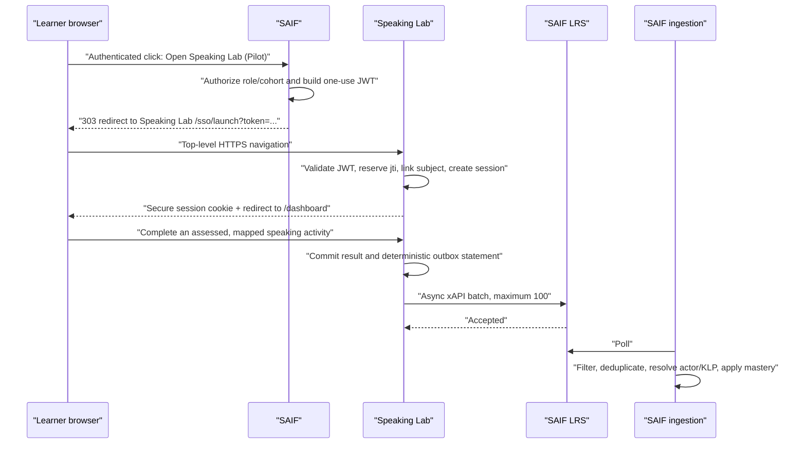

# SAIF Programmer Guide: Launching and Connecting Speaking Lab

**Prepared:** 2026-07-30
**Audience:** SAIF backend, frontend, identity, and platform programmers
**Purpose:** Add Speaking Lab to SAIF without replacing SAIF's existing tutor, duplicating learner identities, leaking personal data, or producing mastery evidence that SAIF cannot resolve.

This document contains no passwords, API keys, signing secrets, LRS credentials, or real learner identifiers. Exchange those only through the approved secret stores.

## 1. Required outcome

An authenticated SAIF learner selects **Open Speaking Lab (Pilot)**. SAIF creates a short-lived, one-use, server-signed launch token and redirects the browser to Speaking Lab. Speaking Lab:

1. validates the signature and claims;
2. links the signed pseudonymous SAIF identity to exactly one local account;
3. creates an authenticated Speaking Lab session;
4. records explicitly assessed, approved KLP results;
5. sends one xAPI statement per assessed KLP through its asynchronous outbox; and
6. uses the same pseudonymous actor identifier for both SAIF-launched and direct-login activity.

SAIF then ingests those statements from the LRS, resolves the actor, validates the KLP and verb, and applies mastery with `source="lrs_ingestion"`.

### Why this design is required

- Speaking Lab is also a standalone product. It must keep its own database and authentication; the two products must not share tables or session stores.
- A learner may enter Speaking Lab through SAIF or through a direct login. Both paths must resolve to one Speaking Lab user and one SAIF actor.
- SAIF mastery is KLP-addressed. Session completion, listening exposure, and aggregate speaking scores without a named KLP are not mastery evidence.
- SAIF's trial identity boundary is pseudonymous. Names and email addresses must not cross in the launch identity or xAPI actor.
- xAPI delivery must not delay a learner request. The Speaking Lab outbox handles delivery, retry, and idempotency asynchronously.

## 2. Authority and verified state

Implement against these pinned files:

1. [`HANDOVER.md`](./HANDOVER.md)
2. [`SAIF_xAPI_Integration_Profile.md`](./SAIF_xAPI_Integration_Profile.md), Profile v1.2
3. [`SAIF_xAPI_Ingestion_Contract_v1.md`](./SAIF_xAPI_Ingestion_Contract_v1.md)
4. [`DEPLOYMENT_DB_IDENTITY_NOTES.md`](./DEPLOYMENT_DB_IDENTITY_NOTES.md)

The four files above were verified byte-for-byte against the supplied
`SAIF_SpeakingTutor_xAPI_handoff_20260720.zip` on 2026-07-30.

The ingestion contract is authoritative for the running admin endpoint paths:

```text
POST /api/admin/ingestion/trigger
GET  /api/admin/ingestion/log
GET  /api/admin/ingestion/unresolved
POST /api/admin/ingestion/actors/map
GET  /api/admin/ingestion/status
```

The shorter `/api/ingestion/*` paths shown in the generic Profile monitoring section are not the runtime admin paths. Do not code against them.

Live checks completed on 2026-07-30:

- Current SAIF sandbox origin:
  `https://saif-app.calmhill-682959c0.eastus2.azurecontainerapps.io`.
- Current Speaking Lab pilot origin:
  `https://speakinglab-app.happyisland-e54e6952.uksouth.azurecontainerapps.io`.
  Keep this in configuration rather than hard-coding it in the launch handler.
- SAIF instructor and learner authentication work.
- Instructor access to `/api/admin/ingestion/*` correctly returns `403`; a SAIF Admin session is required.
- SAIF's current `/apps/speaking` route opens SAIF's own internal tutor. It does not currently launch the external Speaking Lab.
- `9-1-F-1-i` is an active Book 9, Lesson 1 function KLP whose base item is **Conduct bank transactions**. It may be used as the first sandbox fixture after curriculum approval; it must not be hard-coded as a universal mapping.
- Speaking Lab's xAPI integration is enabled and configured with source application `speaking-lab`.
- The supplied LRS credential is write-only. Verify delivery through SAIF's ingestion administration, not by attempting an LRS `GET`.

## 3. Values that must not be confused

| Purpose | Required value or rule |
|---|---|
| xAPI KLP, verb, activity-type, and extension namespace | `https://saif.training` |
| xAPI actor account homepage | `https://saif.rsaf.mil` |
| xAPI source application | `speaking-lab` |
| JWT audience | `speaking-lab` |
| Speaking Lab SSO provider ID | `saif` |
| JWT issuer | An exact, jointly agreed, environment-specific value |
| JWT subject | One stable pseudonymous SAIF learner identifier |
| LRS authority | Stamped by the dedicated LRS credential; do not self-declare it |

`https://saif.rsaf.mil` remains the agreed actor account homepage. It must not be used for SAIF-owned xAPI verbs, KLP objects, activity types, or extension keys.

Do not use `speaking-tutor` as the source application. Profile v1.2 reserves it for SAIF-native use. The external product sends `speaking-lab`; the dedicated writer credential identifies the producer authoritatively at the LRS.

## 4. Decisions to record before coding

Record these in configuration and the teams' decision log, without recording secret values:

1. **Pseudonymous `sub` format.** For the pilot, the recommended choice is SAIF's stable user UUID if SAIF confirms that it is pseudonymous, immutable, and preserved across the trial. Do not use email, display name, rank, or student name.
2. **Exact issuer.** Configure a stable sandbox issuer string. Do not derive it at runtime from an incoming `Host` header, and do not silently change it when the container hostname changes.
3. **Shared signing secret ownership.** Generate at least 32 cryptographically random bytes. Store the same value in SAIF's secret store and Speaking Lab's Azure Key Vault. Never place it in source, CI variables printed to logs, screenshots, tickets, or chat.
4. **Pilot eligibility.** Identify the learner/cohort feature flag that controls who sees the external launch. Default it off.
5. **Approved KLP crosswalk.** SAIF curriculum owners must approve each Speaking Lab activity-to-`concept_id` mapping. Scenario IDs and UI labels are not KLP IDs.
6. **SAIF Admin operator.** Name the administrator who will configure actor mappings and inspect ingestion outcomes.

If any of these decisions is unresolved, keep the external launch flag off.

## 5. End-to-end sequence



There is no browser-to-browser API call and no shared authentication cookie. A top-level redirect does not require CORS.

## 6. SAIF backend implementation

### 6.1 Configuration

Use names equivalent to:

```text
SPEAKING_LAB_LAUNCH_ENABLED=false
SPEAKING_LAB_ORIGIN=https://YOUR-SPEAKING-LAB-ORIGIN
SPEAKING_LAB_SSO_ISSUER=EXACT-AGREED-ISSUER
SPEAKING_LAB_SSO_AUDIENCE=speaking-lab
SPEAKING_LAB_SSO_SHARED_SECRET=<secret-store-reference>
SPEAKING_LAB_ALLOWED_ROLES=learner,instructor
```

Rules:

- `SPEAKING_LAB_ORIGIN`, issuer, and audience are configuration, not secrets.
- The signing secret is server-only and must come from a secret store.
- Use separate values for sandbox and production.
- The launch remains disabled if any required value is missing.
- Do not reuse the LRS password, SAIF session secret, Speaking Lab job token, database password, or any provider API key as the signing secret.

### 6.2 Server-side launch endpoint

Add an authenticated SAIF endpoint or server action such as:

```text
POST /api/apps/speaking-lab/launch
```

It must:

1. require the existing authenticated SAIF session;
2. enforce CSRF protection used by other SAIF state-changing actions;
3. require an allowed learner or instructor role;
4. require pilot/cohort eligibility while the feature is in trial;
5. derive the user and `sub` from the authenticated server-side session, never request parameters;
6. create a fresh `jti` for every click;
7. use integer Unix seconds for `iat` and `exp`;
8. set `exp = iat + 60`;
9. sign with HS256 using the server-side secret;
10. URL-encode the token; and
11. return a `303` redirect to the configured, allowlisted Speaking Lab origin.

Do not accept a caller-provided destination origin, subject, role, display name, issuer, or audience.

### 6.3 Required JWT

```json
{
  "iss": "EXACT_AGREED_ISSUER",
  "aud": "speaking-lab",
  "sub": "PSEUDONYMOUS_STABLE_SAIF_ID",
  "role": "Student",
  "displayName": "Pseudonymous learner label",
  "iat": 1800000000,
  "exp": 1800000060,
  "jti": "NEW_RANDOM_UUID",
  "redirectTo": "/dashboard"
}
```

Rules enforced by Speaking Lab:

- header algorithm must be exactly `HS256`;
- signature, issuer, and audience must match exactly;
- shared secret must be at least 32 characters/bytes as supplied by deployment;
- `sub`, `role`, `displayName`, `iat`, `exp`, and `jti` are required;
- `iat` and `exp` must be integer Unix seconds, not milliseconds;
- `exp` must be later than `iat`;
- total declared lifetime must be no more than 120 seconds;
- token age must be no more than 120 seconds;
- future clock skew is limited to 30 seconds;
- `Student` and `Teacher` are supported;
- external `Admin` launch is disabled;
- each `(provider, jti)` is accepted once;
- `redirectTo` must be a local, non-API path.

Use a 60-second lifetime. Synchronize both hosts with a reliable time source.

Do not include `email` or `studentNumber` for the SAIF trial. Speaking Lab intentionally ignores them for linking, but omitting them prevents accidental PII exposure.

### 6.4 Python reference

Adapt this to SAIF's existing authentication, settings, CSRF, logging, and response helpers:

```python
import os
import time
import uuid
from urllib.parse import urlencode

import jwt
from fastapi import APIRouter, Depends, HTTPException
from fastapi.responses import RedirectResponse

router = APIRouter()


@router.post("/api/apps/speaking-lab/launch")
async def launch_speaking_lab(current_user=Depends(require_current_user)):
    if os.environ.get("SPEAKING_LAB_LAUNCH_ENABLED") != "true":
        raise HTTPException(status_code=503, detail="Speaking Lab launch is disabled")

    if current_user.role not in {"learner", "instructor"}:
        raise HTTPException(status_code=403, detail="Role is not eligible")

    if not is_speaking_lab_pilot_user(current_user):
        raise HTTPException(status_code=403, detail="User is not in the pilot")

    # This must be the approved stable pseudonymous identifier.
    subject = approved_pseudonymous_subject(current_user)
    if not subject:
        raise HTTPException(status_code=409, detail="Pseudonymous identity is unavailable")

    now = int(time.time())
    payload = {
        "iss": settings.SPEAKING_LAB_SSO_ISSUER,
        "aud": "speaking-lab",
        "sub": subject,
        "role": "Student" if current_user.role == "learner" else "Teacher",
        "displayName": approved_pseudonymous_label(current_user),
        "iat": now,
        "exp": now + 60,
        "jti": str(uuid.uuid4()),
        "redirectTo": "/dashboard",
    }
    token = jwt.encode(
        payload,
        settings.SPEAKING_LAB_SSO_SHARED_SECRET,
        algorithm="HS256",
    )
    target = (
        settings.SPEAKING_LAB_ORIGIN.rstrip("/")
        + "/sso/launch?"
        + urlencode({"token": token})
    )
    return RedirectResponse(target, status_code=303, headers={
        "Cache-Control": "no-store",
        "Referrer-Policy": "no-referrer",
    })
```

The exact endpoint name and dependency names may differ in SAIF. The security and claim rules must not.

### 6.5 Logging and telemetry

Never log:

- the JWT;
- a full launch URL;
- the signing secret;
- LRS Authorization headers;
- real names or email addresses in integration logs.

Configure access-log and APM query-string redaction for `/sso/launch`. Log only:

- a generated correlation ID;
- result category;
- role;
- environment;
- timestamp; and
- a one-way hash or redacted suffix of the pseudonymous subject only when operationally necessary.

Do not send the launch URL to analytics, link shorteners, email, chat, error trackers, or client-side telemetry.

## 7. SAIF frontend implementation

For the pilot:

1. Keep the current SAIF internal Speaking Tutor unchanged.
2. Add a separate **Open Speaking Lab (Pilot)** action.
3. Show it only when the backend says the user is eligible.
4. Submit a same-origin `POST` to the server-side launch endpoint.
5. Let the server return the external redirect.
6. Do not generate or inspect the JWT in browser JavaScript.
7. Do not place learner IDs in query parameters or browser storage.
8. Disable repeated clicks while the launch request is in progress.

If the browser loses the redirect response, request a new launch by clicking again. Do not retry a previously generated token because it may already have been consumed.

Only replace the internal tutor navigation after the full pilot acceptance checklist passes and the product owner explicitly approves the change.

## 8. Speaking Lab behavior already implemented

Speaking Lab exposes:

```text
GET /sso/launch?token=<one-use-JWT>
```

On a valid launch it performs one PostgreSQL transaction:

1. reserves `(provider="saif", jti)` using a unique constraint;
2. resolves an existing `(provider, sub)` external identity;
3. otherwise resolves an exact local username/student code equal to `sub`;
4. otherwise creates one code-keyed account;
5. associates the launch reservation with that account;
6. creates a hashed server-side session; and
7. returns a secure `HttpOnly`, `SameSite=Lax` session cookie.

It never links by name or email. Replay reservation occurs before account mutation, so the same token cannot reactivate, relabel, or duplicate an account.

Speaking Lab production configuration:

```text
EXTERNAL_SSO_ENABLED=true
EXTERNAL_SSO_PROVIDER_ID=saif
EXTERNAL_SSO_ISSUER=<exact agreed value>
EXTERNAL_SSO_AUDIENCE=speaking-lab
EXTERNAL_SSO_SHARED_SECRET=<Azure Key Vault reference>
EXTERNAL_SSO_ALLOW_ADMIN=false
SESSION_COOKIE_SECURE=true
```

The current Azure templates fail closed: SSO remains disabled unless the issuer, audience, and a sufficiently long shared secret are all present.

## 9. Actor identity and mapping

Speaking Lab emits this actor for every linked SAIF learner:

```json
{
  "objectType": "Agent",
  "account": {
    "homePage": "https://saif.rsaf.mil",
    "name": "THE_SAME_SIGNED_SUB"
  }
}
```

The actor must be identical whether the learner arrived through SAIF or later used the linked Speaking Lab direct-login account.

Map it in SAIF using an Admin session:

```http
POST /api/admin/ingestion/actors/map
Content-Type: application/json

{
  "external_identifier": "THE_SAME_SIGNED_SUB",
  "saif_user_id": "TARGET_SAIF_USER_UUID",
  "identifier_type": "account"
}
```

If SAIF approves its own stable user UUID as `sub`, the two identifier values may be the same UUID. Still create or verify the actor-map entry; do not assume automatic resolution unless the running ingestion service explicitly documents it.

Never use the learner email as `external_identifier` for this pilot.

## 10. KLP mapping

SAIF owns the KLP catalog and approves the mapping. For every Speaking Lab activity, record:

| Field | Requirement |
|---|---|
| Speaking Lab activity/scenario ID | Stable local identifier |
| SAIF `concept_id` | Exact active catalog value |
| Assessment mode | `speaking_performance` or `context_only` |
| Support status | `speaking_scored`, `context_only`, or unsupported |
| Threshold | Existing activity threshold; scenarios pass at 75% |
| Approval | SAIF curriculum owner and date/version |

Important:

- A SAIF scenario ID such as `b9l1_bank_transactions` is not a KLP ID.
- The first confirmed live sandbox candidate is `9-1-F-1-i`, but it must be explicitly approved for the corresponding Speaking Lab activity.
- Listening exposure and context-only links must not emit mastery evidence.
- An aggregate monologue without a named, assessed KLP must not emit.
- Unknown or inactive KLPs must not emit.
- If a turn explicitly assesses several approved KLPs, emit one statement per KLP. Do not attach undeclared KLPs after the fact.

Before enabling delivery, SAIF should return the approved crosswalk as versioned data, not an informal message.

## 11. xAPI statement contract

Speaking Lab emits Profile v1.2 core fields only:

```json
{
  "id": "DETERMINISTIC_UUID",
  "actor": {
    "objectType": "Agent",
    "account": {
      "homePage": "https://saif.rsaf.mil",
      "name": "THE_SAME_SIGNED_SUB"
    }
  },
  "verb": {
    "id": "http://adlnet.gov/expapi/verbs/answered",
    "display": {
      "en-US": "answered"
    }
  },
  "object": {
    "objectType": "Activity",
    "id": "https://saif.training/klp/dli_alc/APPROVED_CONCEPT_ID",
    "definition": {
      "type": "https://saif.training/activity-types/klp"
    }
  },
  "result": {
    "success": true,
    "score": {
      "scaled": 0.84
    }
  },
  "context": {
    "extensions": {
      "https://saif.training/extensions/skill": "speaking",
      "https://saif.training/extensions/source-app": "speaking-lab"
    }
  },
  "timestamp": "2026-07-30T00:00:00.000Z"
}
```

Verb selection:

| Speaking Lab evidence | Verb |
|---|---|
| Ordinary assessed spoken response | `http://adlnet.gov/expapi/verbs/answered` |
| Scheduled review | `https://saif.training/verbs/reviewed` |
| Assessed scenario role-play | `https://saif.training/verbs/practiced` |

The score is the real composite or scenario score scaled to `0..1`; it is not converted to a binary 0/100 score.

Pronunciation, phoneme, fluency, pace, pause, and scenario diagnostic signals remain local until SAIF publishes approved extension IRIs. Do not invent extension names.

## 12. LRS and ingestion requirements on the SAIF side

SAIF operations must verify:

- the dedicated writer credential has only the intended statement-write scope;
- its authority differentiates Speaking Lab from other producers;
- `xapi_ingestion_enabled` is enabled only in the intended environment;
- the ingestion poller points to the same LRS;
- the activity prefix is `https://saif.training/klp/`;
- `speaking-lab` is not in the source-app skip set;
- `speaking-tutor` remains reserved for SAIF-native activity;
- accepted evidence verbs match the pinned ingestion contract;
- KLP resolution requires an active `concept_id`;
- actor mapping supports `identifier_type="account"`;
- statement `id` is the deduplication key; and
- Admin ingestion endpoints require Admin authorization.

Speaking Lab posts arrays of at most 100 statements using:

```http
POST <LRS statements endpoint>
Authorization: Basic <dedicated writer credential>
Content-Type: application/json
X-Experience-API-Version: 1.0.3
```

Do not ask Speaking Lab to perform an LRS `GET` with the write-only credential. Use SAIF's ingestion status and ledger endpoints.

## 13. Joint test plan

### Phase A: disabled configuration

- [ ] Deploy both code paths with launch disabled.
- [ ] Missing issuer, audience, or secret fails closed.
- [ ] Existing SAIF internal Speaking Tutor still works.
- [ ] Speaking Lab direct login still works.

### Phase B: signed-launch security

Use pseudonymous sandbox fixtures only:

- [ ] Valid learner token launches once.
- [ ] Valid instructor token launches only if the pilot permits instructors.
- [ ] External Admin role returns `403`.
- [ ] Replaying the exact token returns `401` and creates no mutation.
- [ ] Tampered signature returns `401`.
- [ ] Wrong issuer returns `401`.
- [ ] Wrong audience returns `401`.
- [ ] Expired token returns `401`.
- [ ] Future `iat` beyond 30 seconds returns `401`.
- [ ] Token older than 120 seconds returns `401`.
- [ ] Lifetime above 120 seconds returns `401`.
- [ ] Millisecond timestamps are rejected.
- [ ] Unsafe `redirectTo`, `//host`, and `/api/...` values fall back to `/dashboard`.
- [ ] Missing configuration returns `503`.
- [ ] No token or launch URL appears in logs, telemetry, screenshots, or browser analytics.

### Phase C: identity

- [ ] A signed `sub` links to an existing direct-login account with the exact same username/student code.
- [ ] A first-time `sub` creates one account.
- [ ] A repeated launch with a new `jti` reuses that account.
- [ ] Matching email or display name does not link a different account.
- [ ] The actor map contains only the pseudonymous `sub`.
- [ ] Direct-login and SAIF-launched evidence produce the same actor account IFI.

### Phase D: KLP and outbox

- [ ] The approved sandbox KLP is active.
- [ ] An assessed ordinary response emits `answered`.
- [ ] A scheduled review emits `reviewed`.
- [ ] A scenario emits `practiced`.
- [ ] `result.success` matches the existing threshold outcome.
- [ ] `result.score.scaled` matches the actual score.
- [ ] Context-only, unassessed, listening-only, aggregate, unknown, and inactive KLP cases emit nothing.
- [ ] Multi-KLP evidence creates one justified statement per approved KLP.
- [ ] Concurrent outbox workers do not claim the same row.
- [ ] Batch size never exceeds 100.
- [ ] Learner requests do not wait for LRS delivery.

### Phase E: live SAIF round trip

1. Launch one mapped pseudonymous fixture from SAIF.
2. Complete one assessed Speaking Lab activity mapped to one approved KLP.
3. Confirm one pending Speaking Lab outbox statement.
4. Run the Speaking Lab xAPI worker.
5. As a SAIF Admin, call `POST /api/admin/ingestion/trigger`.
6. Inspect `GET /api/admin/ingestion/log?result=applied`.
7. If needed, inspect `GET /api/admin/ingestion/unresolved`, create the actor map, and trigger again with a newly emitted fixture statement.
8. Confirm the intended learner and KLP mastery changed with `source="lrs_ingestion"`.
9. Re-submit the same statement ID and confirm the outcome is `duplicate`.
10. Confirm mastery was not applied twice.

An old `unresolved_actor` ledger row remains historical after mapping; use a new statement or the running adapter's documented reprocessing behavior for the post-map proof.

### Phase F: security and regression

- [ ] No credentials or JWTs in either repository or Git history.
- [ ] No secret in HTTP responses, browser bundles, logs, build artifacts, container layers, backups, or migration reports.
- [ ] Instructor and learner cannot call SAIF Admin ingestion endpoints.
- [ ] Teacher and learner cannot call Speaking Lab Admin xAPI endpoints.
- [ ] HTTPS only; secure cookies enabled.
- [ ] Both applications pass their existing build, unit, integration, role, and browser tests.
- [ ] Rollback flags have been exercised in sandbox.

## 14. Deployment order

1. Merge and deploy the SAIF backend launch endpoint with its feature flag off.
2. Deploy the separate pilot UI action with the flag off.
3. Agree the issuer, subject format, and pilot cohort.
4. Generate and store the shared secret out of band.
5. Configure Speaking Lab with SSO still disabled; verify health.
6. Configure SAIF with launch still disabled; verify health.
7. Enable Speaking Lab SSO for sandbox fixtures.
8. Enable the SAIF launch action for one sandbox learner.
9. Complete signed-launch and identity tests.
10. Approve the KLP crosswalk and actor map.
11. Complete one xAPI round trip.
12. Complete duplicate and failure-path tests.
13. Obtain joint technical, curriculum, data-protection, and product sign-off.
14. Expand the pilot cohort gradually.

Do not enable xAPI for a learner until the subject format, actor map, and KLP mapping are verified.

## 15. Rollback

If launch identity is wrong:

1. disable `SPEAKING_LAB_LAUNCH_ENABLED`;
2. disable `EXTERNAL_SSO_ENABLED` in Speaking Lab if necessary;
3. leave direct login available;
4. preserve audit rows and investigate before changing mappings.

If evidence mapping or ingestion is wrong:

1. disable `XAPI_ENABLED` in Speaking Lab;
2. stop the xAPI worker;
3. do not delete pending outbox rows;
4. preserve deterministic statement IDs and failure details;
5. correct the approved mapping or configuration;
6. retest in sandbox before retrying.

Do not delete mastery or ledger rows manually as an integration rollback. Use SAIF's reviewed operational correction process.

## 16. Evidence the SAIF programmer must return

Return a short, secret-free handoff containing:

- SAIF pull request and commit;
- exact non-secret issuer, audience, provider ID, and Speaking Lab origin;
- approved `sub` rule, described without fixture values;
- feature-flag name and eligible sandbox cohort;
- secret-store reference names, not values;
- versioned KLP crosswalk;
- negative-token test results;
- actor-map and ingestion test outcomes with learner identifiers redacted;
- confirmation that query-string/token logging is disabled or redacted;
- deployment and rollback result; and
- any changes to the pinned Profile or ingestion contract.

If SAIF changes the actor rules, endpoint paths, KLP prefix, accepted verbs, source-app rules, or extension IRIs, re-issue the pinned contract and stop the cutover until Speaking Lab re-syncs and retests.
